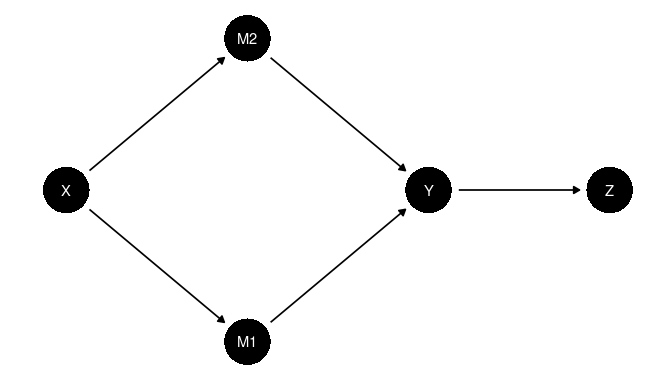

<!-- README.md is generated from README.Rmd. Please edit that file -->

# CausalQueriesTools

<!-- badges: start -->

[](https://github.com/till-tietz/CausalQueriesTools/actions/workflows/R-CMD-check.yaml)
[](Redirect-URL)
<!-- badges: end -->

`CausalQueriesTools` is currently in development, very much
experimental. It is intended to be a companion package to
`CausalQueries`, implementing optimized core `CausalQueries` methods to
make, update and query very large causal models.

[CausalQueries
CRAN](https://cran.r-project.org/web/packages/CausalQueries/index.html)
[CausalQueries GitHub](https://github.com/macartan/CausalQueries)
[Handbook](https://macartan.github.io/causalmodels/)

1.  [Installation](#install)  
2.  [Usage](#usage)  
3.  [Methods & Benchmarks](#methods)  
    3.1 [Motivation](#motivation)  
    3.2 [Creating large causal models](#creating)  
    3.3 [Updating large causal models](#updating)  
    3.4 [Querying large causal models](#querying)  
4.  [Development](#development)

<a name="install"></a>

## Installation

You can install the development version of CausalQueriesTools from
[GitHub](https://github.com/) with:

``` r
# install.packages("devtools")
devtools::install_github("till-tietz/CausalQueriesTools")
```

<a name="usage"></a>

## Usage

``` r
library(CausalQueries)
library(CausalQueriesTools)

# create a simple model assuming monotonicity and no interactions 
# add select interactions back into the model 
# two way interactions of M1 & M2 on Y and M3 & M4 on Y
model <- make_simple_model("X -> M1; X -> M2; X -> M3; X -> M4;
                            M1 -> Y; M2 -> Y; M3 -> Y; M4 -> Y") |>
  interact_model(interactions = list(c("M1","M2","Y"),c("M3","M4","Y")))

# generate data from causal model 
data <- CausalQueries::make_data(model,1000)

# update model utilizing graph splitting 
# setting parallel true will run optimal nested parallelism i.e. updating models in parallel and 
# running markov chains within models in parallel 
model <- update_stitch(model, data, chains = 2, parallel = TRUE)
```

<a name="methods"></a>

## Methods & Benchmarks

<a name="motivation"></a>

### Motivation

Complex theories beget complex models; posing substantial computational
challenges to the practical application of the `CausalQueries` framework
to theories of complexity often favored by practitioners. Even
relatively harmless seeming DAGs may begin to test the limits of memory
and processing power available on modern hardware once encoded as causal
models with standard `CausalQueries`. Consider, by way of illustration,
the model described by the following DAG. It alone has \~4 Billion
nodal- and \~8796 Billion causal-types, as well as a myriad of further
parameters attached to both.


The simple fact that a binary node’s set of nodal-types grows as a
function of its number of parents $k$ by $2^{(2^k)}$ and that a model’s
set of causal-types is the product of its component nodal-types
$$\prod_{i = 1}^{i = nodes} |types_i|$$, means that certain theories
quickly become impossible to represent and operate on as causal
models.  
Simply storing all nodal-types on $Y$ would require \~94 GB of memory.
Storing a matrix of causal type distributions with a standard 4000 draws
for this model would consume on the order of \~281472 TB of memory.
Clearly special, optimized methods for model creating, updating and
querying are needed for models of such size.

<a name="creating"></a>

### Creating large causal models

Encoding large causal models with `CausalQueries` requires a restriction
of the nodal type space via monotonicity and no interaction assumptions.
`CausalQueriesTools` provides the `make_simple_model()` function to this
end. This effectively reverses the standard `CausalQueries` workflow of
`make_model()` $\longrightarrow$ `restrict_model()` by creating
nodal-types consistent with the above assumptions and attaching them to
the model. `CausalQueriesTools` further allows adding interactions of
arbitrary order on any node back into monotonistic, non-interacted
models via the `interact_model()` function. This method exploits the
fact that interaction nodal-types can be generated from monotonistic,
non-interacted nodal-types by applying logical AND and OR operations to
their component digits. In a monotonistic, non-interacted model
described by the DAG $X \rightarrow Y; Z \rightarrow Y$, $Y$ has
nodal-types $\{0000,0101,0011,1111\}$ with $\{0101,0011\}$ describing
monotonic effects. Generating an interaction of $X$ and $Z$ on $Y$ can
be accomplished by performing $0101 \text{ AND } 0011 = 0001$ and
$0101 \text{ OR } 0011 = 0111$, yielding the nodal-type set
$\{0000,0101,0011,0001,0111,1111\}$ on $Y$.

<a name="updating"></a>

### Updating large causal models

`CausalQueriesTools` utilizes graph splitting and nested parallel
processing to make updating large causal modles more efficient. The
`update_stitch()` functionality leverages the local markov property to
factor DAGs into more efficiently updatable sub-DAGs. Given the
following causally ordered DAG
$X_1 \rightarrow X_2 \rightarrow X_3 \rightarrow X_4$, by local markov.
$$X_{i+1} \perp (X_1,...,X_{i-1}) | X_i$$ More generally since any
probability distribution $P(X)$ can be written as
$$P(X) = \prod_{i = 1}^n P(X_{\pi i} | X_{\pi 1},...,X_{\pi i-1})$$
where $\pi$ is a permutation of indices, we can factorize a probability
distribution $P(X)$ over a DAG. $D$ as
$$P(X) = \prod_{i = 1}^n P(X_i | PARENT_i)$$ Every node is independent
of its non-descendants given its parents. The following DAG can thus be
factorized like so:



$P(X)=P(X)P(M_1|X)P(M_2|X)P(Y|M_1,M_2)P(Z|Y)$. This means we can split
it into the following sub-DAGs.


Instead of updating a full model using standard `CausalQueries`
`update_model()`, `update_stitch()` can thus update its much simpler
component sub-models and ‘stitch’ the posteriors back together. Using
this process, model updating run-time no longer grows exponentially with
model size, but rather linearly with respect to the average complexity
of component sub-models. We are able to further optimize run-time by
implementing nested futures evaluation for parallel processing. Nested
parallelism allows `update_stitch()` update sub-models in parallel while
also running markov chains within each sub-model in parallel. Given a
sufficient number of cores the optimal run-time of `update_stitch()` is
therefore the updating time of the most complex sub-model plus overhead
created by splitting, stitching and parallel process set-up.

A performance comparison updating the above model on data with 1000
observations yields the following results:  
<table class=" lightable-classic-2 table" style="font-family: &quot;Arial Narrow&quot;, &quot;Source Sans Pro&quot;, sans-serif; width: auto !important; margin-left: auto; margin-right: auto; margin-left: auto; margin-right: auto;">
<caption>
Unit: seconds
</caption>
<thead>
<tr>
<th style="text-align:left;">
method
</th>
<th style="text-align:right;">
min
</th>
<th style="text-align:right;">
mean
</th>
<th style="text-align:right;">
median
</th>
<th style="text-align:right;">
max
</th>
</tr>
</thead>
<tbody>
<tr>
<td style="text-align:left;">
update_model
</td>
<td style="text-align:right;">
35.83
</td>
<td style="text-align:right;">
38.69
</td>
<td style="text-align:right;">
38.88
</td>
<td style="text-align:right;">
40.33
</td>
</tr>
<tr>
<td style="text-align:left;">
update_stitch
</td>
<td style="text-align:right;">
8.99
</td>
<td style="text-align:right;">
10.07
</td>
<td style="text-align:right;">
10.00
</td>
<td style="text-align:right;">
11.08
</td>
</tr>
</tbody>
</table>
  
To show that both methods yield the same result we query the updated
models for an ATE of $X$ on $Z$.  
<table class=" lightable-classic-2 table" style="font-family: &quot;Arial Narrow&quot;, &quot;Source Sans Pro&quot;, sans-serif; width: auto !important; margin-left: auto; margin-right: auto; margin-left: auto; margin-right: auto;">
<thead>
<tr>
<th style="text-align:left;">
method
</th>
<th style="text-align:right;">
mean
</th>
<th style="text-align:right;">
sd
</th>
<th style="text-align:right;">
conf.low
</th>
<th style="text-align:right;">
conf.high
</th>
</tr>
</thead>
<tbody>
<tr>
<td style="text-align:left;">
update_model
</td>
<td style="text-align:right;">
2.04e-05
</td>
<td style="text-align:right;">
0.0000924
</td>
<td style="text-align:right;">
-0.0001645
</td>
<td style="text-align:right;">
0.0002509
</td>
</tr>
<tr>
<td style="text-align:left;">
update_stitch
</td>
<td style="text-align:right;">
2.09e-05
</td>
<td style="text-align:right;">
0.0001026
</td>
<td style="text-align:right;">
-0.0001702
</td>
<td style="text-align:right;">
0.0002623
</td>
</tr>
</tbody>
</table>

  
To illustrate the above points on the performance gains derived through
model splitting, we benchmark `update_model()` and `update_stitch()` on
updating models of increasing size with data consisting of 1000
observations. Models are simple causal chains with 2 to 7 nodes. We
update each model 10 times using each function and present average
run-times. We run 4 markov chains in parallel for both `update_model()`
and `update_stitch()`, with `update_stitch()` further parallelising
across sub-models.


<a name="querying"></a>

### Querying large causal models

Space and time complexity efficient querying of causal models with
billions of causal-types is currently under development.

Querying a causal model, at its most fundamental involves taking the
matrix product between an 1 x m matrix of causal types and a m x n
matrix of causal type distributions where ‘m’ is the number of causal
types implicated by a given query and ‘n’ is the number of draws from a
causal type’s probability distribution. This matrix product is
normalized by a vector of column sums of the m x n causal type
probability distribution matrix.

The above process requires 5 key data structures:

1.  the matrix of causal types implicated by a query
2.  the matrix of causal type distributions
3.  a matrix mapping parameters to causal types
4.  a matrix of parameter distributions
5.  a set of matrices of realised outcomes for each node and causal type

More specifically the construction of the 1 x m matrix of causal types
implicated by a query requires a set of matrices of realised outcomes
given a set of do operations. The construction of the m x n matrix of
causal type distributions requires a mapping of parameters to causal
types and a matrix of parameter distributions. All data structures but
the parameter distribution grow with the number of causal types in a
model. Assuming a model with 1x10^9 causal types, constructing an
integer vector of causal types would consume 4 Gigabytes of memory (4
bytes per signed integer x 1x10^9). Constructing a double matrix of
causal type distributions with the standard 4000 draws consumes 32000
Gigabytes (64 Terabytes) of memory (8 bytes per double x 4000 x 1x10^9).
These estimates represent lower bounds on memory usage ignoring
pointers, metadata, attributes and memory consumed by operations on the
data structures.

<a name="development"></a>

## Development

#### Implemented

- <input type="checkbox" checked> generating causal models with up to n
  \> 4 parents per child by imposing monotonicity and no-interaction
  restrictions</input>
- <input type="checkbox" checked> functionality to add interactions back
  to monotonicity and no-interaction models</input>
- <input type="checkbox" checked> updating large models via graph
  splitting and stitching (currently only possible without confounding
  and with complete data)</input>

#### Under Development

- <input type="checkbox" unchecked> space & time complexity efficient
  querying</input>
- <input type="checkbox" unchecked> updating via graph splitting and
  stitching with confounding and missing data </input>

#### Possible Developments

- <input type="checkbox" unchecked> helpers to generate optimal graph
  splitting strategies</input>
- <input type="checkbox" unchecked> methods for validating DAGs using
  data</input>
